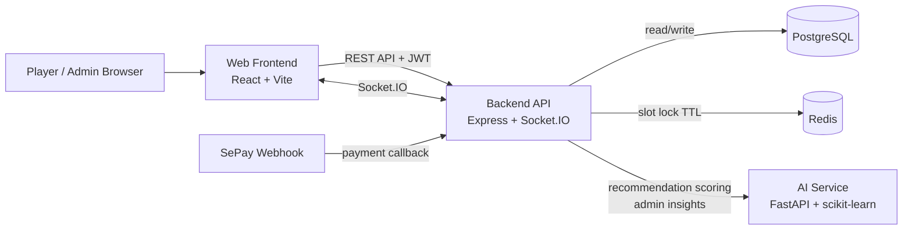
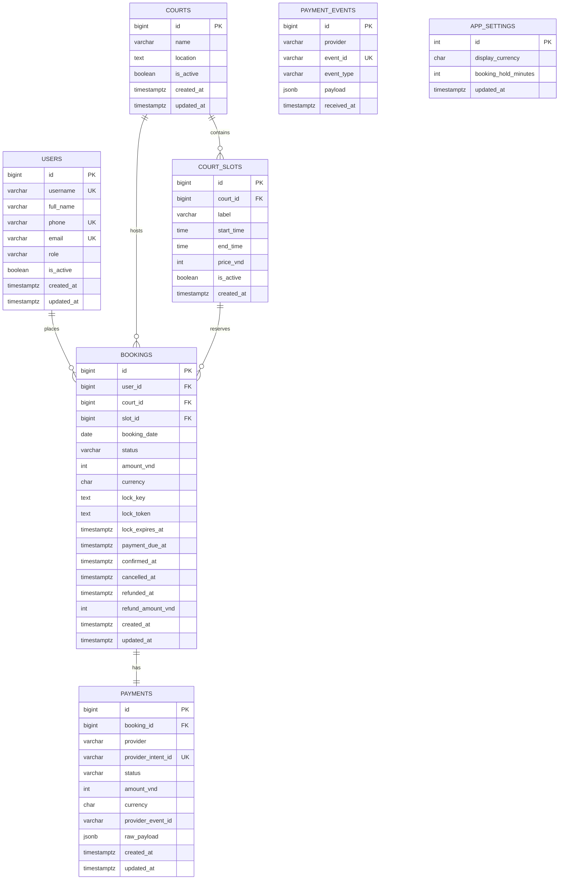

# SMART BADMINTON COURT MANAGEMENT SYSTEM

Hệ thống quản lý sân cầu lông gồm 3 service ứng dụng và 2 service hạ tầng:
- `web` (`React + Vite`): giao diện người dùng và admin dashboard.
- `backend` (`Node.js + Express + Socket.IO`): API nghiệp vụ, xác thực, booking realtime, analytics, payment webhook.
- `ai-service` (`FastAPI + scikit-learn`): chấm điểm khung giờ/sân đề xuất và sinh admin insights.
- `postgres`: lưu trữ dữ liệu nghiệp vụ.
- `redis`: khóa slot tạm thời để chống double-booking.

> Tài liệu bên dưới mô tả runtime hiện tại dùng bởi `docker-compose.yml`, `backend/src/db/schema.sql` và `backend/src/db/migrate.js`. Thư mục `database/` là bộ SQL độc lập/legacy, không phải schema Docker đang mount mặc định.

## Tài khoản seed để test nhanh

- `Admin`: `admin@smartbadminton.com` / `admin123`
- `User`: `john@example.com` / `user123`

## 1) Kiến trúc hệ thống



### Vai trò từng thành phần

- `web`: login, xem sân, xem availability, tạo booking, thanh toán, quản trị users/courts/bookings/analytics.
- `backend`: source of truth cho nghiệp vụ; tự bootstrap schema/migration khi start; phát event `slot_updated`.
- `ai-service`: tiêu thụ lịch sử booking và danh sách slot khả dụng để trả về recommendation/ranking.
- `postgres`: lưu `users`, `courts`, `court_slots`, `bookings`, `payments`, `payment_events`, `app_settings`.
- `redis`: giữ distributed lock theo `courtId + slotId + date` để tránh đặt trùng khi concurrent request.

### Port mặc định

- `web`: `5173`
- `backend`: `4000`
- `ai-service`: `8001`
- `postgres`: `5432`
- `redis`: `6379`

## 2) ERD

ERD dưới đây phản ánh schema runtime của backend: `backend/src/db/schema.sql` + migration runtime trong `backend/src/db/migrate.js`.



### Ràng buộc nghiệp vụ quan trọng

- `uq_bookings_active_slot` đảm bảo một `court + slot + date` chỉ có tối đa một booking ở trạng thái `LOCKED` hoặc `CONFIRMED`.
- `court_slots` có unique `(court_id, start_time, end_time)` để tránh tạo slot trùng.
- `payments.booking_id` là `UNIQUE`, tức một booking chỉ gắn với một payment record chính.
- `payment_events` không có FK sang `payments`; bảng này dùng như audit log cho webhook event từ provider.
- `app_settings` được tạo ở migration runtime, không nằm trong `schema.sql` gốc.

## 3) API documentation

### Base URLs

- Backend API: `http://localhost:4000`
- AI Service: `http://localhost:8001`
- AI Swagger UI: `http://localhost:8001/docs`
- AI OpenAPI JSON: `http://localhost:8001/openapi.json`

### Authentication

Các route backend có auth dùng header:

```http
Authorization: Bearer <access_token>
```

### Response format

Backend trả về envelope thống nhất:

```json
{
  "success": true,
  "message": "OK",
  "data": {}
}
```

Lỗi backend:

```json
{
  "success": false,
  "error": {
    "code": "VALIDATION_ERROR",
    "message": "username, email, phone, and password are required",
    "details": null
  }
}
```

### Backend endpoints

#### Auth

| Method | Path | Auth | Mô tả |
|---|---|---|---|
| `POST` | `/auth/register` | No | Đăng ký user mới, trả về `accessToken` |
| `POST` | `/auth/login` | No | Đăng nhập bằng `identifier` hoặc `username/email` |
| `GET` | `/auth/me` | User | Lấy profile hiện tại |
| `PATCH` | `/auth/me` | User | Cập nhật `username`, `fullName`, `phone` |
| `PATCH` | `/auth/me/password` | User | Đổi mật khẩu hiện tại |

Payload mẫu đăng ký:

```json
{
  "username": "player_new",
  "fullName": "Player New",
  "email": "player_new@example.com",
  "phone": "0901234567",
  "password": "secret123"
}
```

Payload mẫu đăng nhập:

```json
{
  "identifier": "admin@smartbadminton.com",
  "password": "admin123"
}
```

#### Settings

| Method | Path | Auth | Mô tả |
|---|---|---|---|
| `GET` | `/settings` | No | Lấy cấu hình hệ thống hiện tại |
| `PATCH` | `/settings` | Admin | Cập nhật `displayCurrency`, `bookingHoldMinutes` |

#### Courts & Recommendations

| Method | Path | Auth | Mô tả |
|---|---|---|---|
| `GET` | `/courts` | User | Danh sách sân; hỗ trợ `includeInactive=true` cho admin |
| `GET` | `/courts/:id` | User | Chi tiết sân |
| `GET` | `/courts/:id/availability?date=YYYY-MM-DD` | User | Availability theo ngày |
| `POST` | `/courts` | Admin | Tạo sân mới |
| `PATCH` | `/courts/:id` | Admin | Cập nhật sân |
| `DELETE` | `/courts/:id` | Admin | Soft delete / deactivate sân |
| `POST` | `/courts/:id/slots` | Admin | Tạo slot cho sân |
| `PATCH` | `/courts/:id/slots/:slotId` | Admin | Cập nhật slot |
| `DELETE` | `/courts/:id/slots/:slotId` | Admin | Xóa slot |
| `GET` | `/recommendations/courts?date=YYYY-MM-DD` | User | Gợi ý sân + khung giờ theo user hiện tại |

Payload mẫu tạo slot:

```json
{
  "startTime": "18:00",
  "endTime": "19:00",
  "priceVnd": 120000,
  "label": "Evening Prime"
}
```

#### Bookings & Payments

| Method | Path | Auth | Mô tả |
|---|---|---|---|
| `POST` | `/bookings` | User | Tạo booking mới ở trạng thái `LOCKED` |
| `GET` | `/bookings` | Admin | Danh sách booking; hỗ trợ `userId`, `userName`, `status`, `dateFrom`, `dateTo`, `page`, `limit` |
| `GET` | `/bookings/user/:id` | User/Admin | Lịch sử booking theo user; hỗ trợ `page`, `limit` |
| `PATCH` | `/bookings/:id/complete` | Admin | Chuyển booking sang `COMPLETED` |
| `DELETE` | `/bookings/:id` | User/Admin | Cancel booking; có thể chuyển `REFUNDED` nếu đã thanh toán |
| `POST` | `/payments/create-intent` | User | Tạo payment intent cho booking |
| `POST` | `/payments/webhook` | No | Webhook thanh toán |
| `POST` | `/payments/webhook/sepay` | No | Alias webhook cho SePay |

Payload mẫu tạo booking:

```json
{
  "courtId": 1,
  "slotId": 11,
  "date": "2026-06-24"
}
```

#### Admin analytics & user management

| Method | Path | Auth | Mô tả |
|---|---|---|---|
| `GET` | `/analytics/overview` | Admin | Tổng quan dashboard + AI insights |
| `GET` | `/analytics/summary` | Admin | KPI tổng hợp |
| `GET` | `/analytics/revenue?start_date&end_date` | Admin | Doanh thu theo ngày |
| `GET` | `/analytics/peak-hours?start_date&end_date` | Admin | Giờ cao điểm |
| `GET` | `/analytics/utilization?start_date&end_date` | Admin | Mức sử dụng tổng |
| `GET` | `/analytics/utilization-by-court` | Admin | Mức sử dụng theo sân |
| `GET` | `/analytics/top-users?start_date&end_date&limit` | Admin | User chi tiêu cao |
| `GET` | `/users` | Admin | Danh sách users |
| `POST` | `/users` | Admin | Tạo user từ trang quản trị |
| `PATCH` | `/users/:id` | Admin | Cập nhật user |
| `PATCH` | `/users/:id/password` | Admin | Reset mật khẩu user |
| `PATCH` | `/users/:id/role` | Admin | Đổi role user/admin |
| `DELETE` | `/users/:id` | Admin | Deactivate user |

### AI service endpoints

| Method | Path | Mô tả |
|---|---|---|
| `GET` | `/health` | Health check của AI service |
| `GET` | `/ai/recommendation/{user_id}` | Gợi ý top slot dựa trên lịch sử dataset |
| `POST` | `/ai/recommendations/score` | Chấm điểm danh sách slot khả dụng theo user + target date + history |
| `POST` | `/ai/admin-insights` | Sinh insight/recommendation cho admin dashboard |

Response mẫu:

```json
{
  "recommended_slots": ["18:00", "19:00", "20:00"]
}
```

## 4) Docker setup

### Yêu cầu

- Docker Desktop hoặc Docker Engine + Compose plugin
- File môi trường backend: `backend/.env`

### Chuẩn bị môi trường

```bash
cp backend/.env.example backend/.env
```

Giá trị mặc định trong `backend/.env.example` đủ để chạy local. Nếu cần test payment provider thật, cập nhật thêm các biến `SEPAY_*`.

### Start toàn bộ hệ thống

```bash
docker compose up -d
```

Lưu ý:
- `postgres` được init bằng `backend/src/db/schema.sql` và `backend/src/db/seed.sql`.
- `backend` sẽ chạy bootstrap runtime migration khi start, bao gồm tạo `app_settings`.
- `ai-service` sẽ tự cài dependencies và tự generate `app/dataset/booking_history.csv` nếu chưa tồn tại.
- `web` và `backend` đều mount source code từ máy local vào container.

### Kiểm tra service

```bash
docker compose ps
curl http://localhost:4000/health
curl http://localhost:8001/health
curl http://localhost:5173
```

### URLs sau khi start

- Web app: `http://localhost:5173`
- Backend health: `http://localhost:4000/health`
- AI health: `http://localhost:8001/health`
- AI Swagger: `http://localhost:8001/docs`
- Postgres: `localhost:5432`
- Redis: `localhost:6379`

### Xem logs

```bash
docker compose logs -f backend
docker compose logs -f ai-service
docker compose logs -f web
```

### Stop / reset

```bash
docker compose down
docker compose down -v
```

- `down`: dừng container, giữ volume dữ liệu.
- `down -v`: xóa cả volume `postgres` và `redis`, phù hợp khi cần reset dữ liệu hoàn toàn.

## 5) Luồng nghiệp vụ chính

### Booking realtime an toàn đồng thời

1. User chọn `court + slot + date`.
2. Backend kiểm tra trạng thái slot trong DB.
3. Backend tạo Redis lock theo key `lock:court:{courtId}:slot:{slotId}:date:{date}`.
4. TTL của lock được điều khiển bởi `BOOKING_LOCK_TTL_SECONDS`.
5. Booking được tạo với trạng thái `LOCKED`.
6. Khi thanh toán thành công, booking chuyển sang `CONFIRMED`.
7. Job nền quét lock hết hạn và chuyển booking sang `CANCELLED`.
8. Mỗi thay đổi booking sẽ emit event Socket.IO `slot_updated`.

### AI recommendation

- Backend lấy lịch sử booking của user + danh sách slot còn trống theo ngày.
- Backend gửi payload sang `ai-service` qua endpoint `/ai/recommendations/score`.
- `ai-service` chấm điểm, xếp hạng và trả về danh sách court/slot ưu tiên.
- Nếu AI service lỗi hoặc timeout, backend fallback về local ranking strategy.

### Admin insights

- Backend tổng hợp KPI, revenue series, peak hour, utilization.
- Dữ liệu được gửi sang `ai-service` qua `/ai/admin-insights`.
- Nếu AI không khả dụng, backend trả về insight fallback từ rule-based logic.

## 6) Socket.IO realtime

Event phát từ backend:

- `slot_updated`

Payload mẫu:

```json
{
  "courtId": 1,
  "slotId": 11,
  "date": "2026-06-24",
  "status": "CONFIRMED",
  "bookingId": 123,
  "lockExpiresAt": "2026-06-24T12:05:00.000Z",
  "updatedAt": "2026-06-24T12:00:10.000Z"
}
```

## 7) Chạy thủ công từng service

### Backend

```bash
cd backend
cp .env.example .env
npm install
npm run db:setup
npm run dev
```

### AI service

```bash
cd ai-service
python3 -m pip install -r requirements.txt
python3 app/dataset/generate_dataset.py
python3 -m uvicorn main:app --host 0.0.0.0 --port 8001 --reload
```

### Web

```bash
cd web
cp .env.example .env
npm install
npm run dev
```

## 8) Kiểm thử / build

### Backend

```bash
cd backend
npm test
```

### Web

```bash
cd web
npm run build
```

### AI service

```bash
cd ai-service
python3 -m py_compile main.py app/models/recommendation_model.py app/services/recommendation_service.py
```
